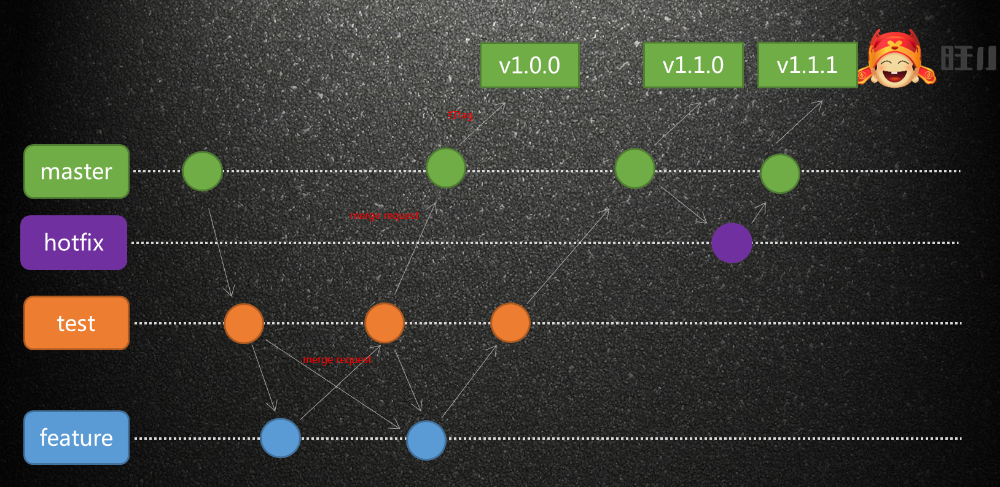

# 一、git常用命令

## 初始化项目

```
git init
```

## 本地仓库与远程服务器连接

```
git remote add ssh://git@gitlab.source3g.com:10022/ftd-study/npm-privatization.git
```
## 添加到缓存区
```
git add *
```

## 提交改动
```
git commit -m feat:改动
```

## 推送代码

```
git push
```

## 用于显示工作目录和暂存区的状态
```
git status
```

## 创建分支
```
git checkout -b feature-v1
```

## 切换分支
```
git checkout master

```

## 删除分支
```
git branch -d feature-v1
```
## 查看远程分支
```
git branch -r 
```

## 将远程主机的最新内容拉到本地

```
git fetch origin master

```

# 二、message规范

类型|说明
---|---
feat:|新功能（feature）
fix:|修改buug
docs:|文档（documentation）
style:|格式(不影响代码运行)
refactor:|重构（即不是新增功能，也不是修改bug的代码变动）
test:|增加测试
chore:|构建过程或辅助工具的变动

例如

```
git commit -m feat:新增权限验证
```

# 三、常用分支介绍

分支|说明
---|---
master|默认主分支，保护分支，不能push
test|测试环境分支，保护分支，不能push
feature|开发分支，从哪里拉出来，再合到哪里，减少冲突

### 代码发布采用git flow的发布流程



# 四、代码回退

## 查看提交记录
```
git log
```
找到要回退的commit,执行

```
git reset --hard f9ac4c3323f505dc833eb1f6f93a8a4685c1ad73
```

强推（强推前一定要把分支的写保护去掉）

```
git push -f
```

# 五、常用问题处理

## 1、git远程删除分支后，本地git branch -a 依然能看到的解决办法。

使用git remote show origin 可以查看remote地址、远程分支、本机分支与远程分支的关系等。

```
git remote show origin
```

这时可以看到远程分支仓库已经不存在的分支，使用 git remote prune origin删除了本机远程不存在的分支 
```
 git remote prune origin
```

[git参考网站](https://www.bootcss.com/p/git-guide/)


