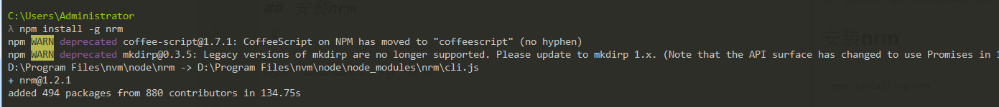
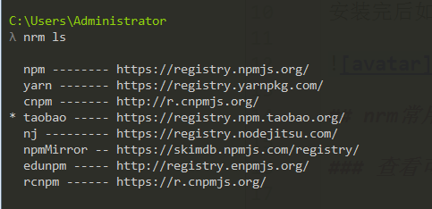
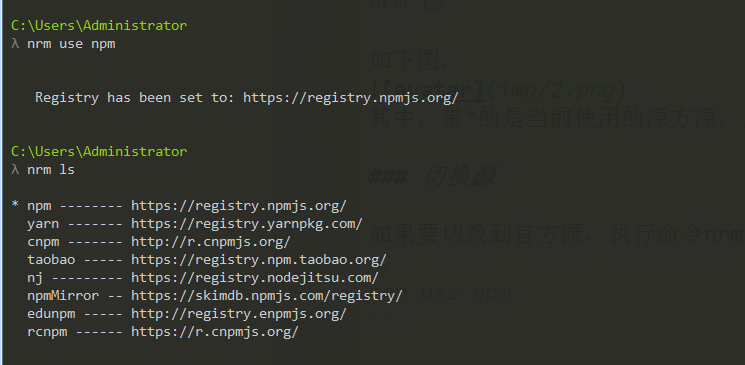
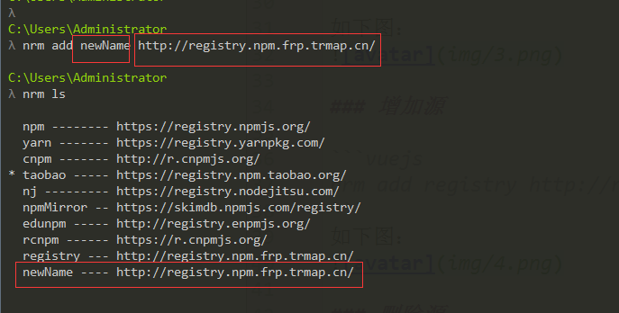
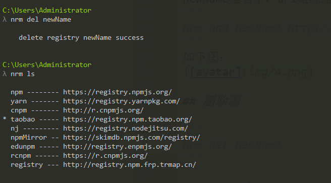
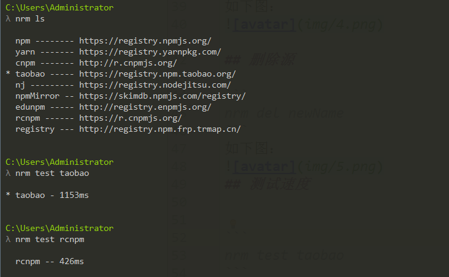

# nrm

nrm(npm registry manager )是npm的镜像源管理工具，有时候国外资源太慢，使用这个就可以快速地在 npm 源间切换,选择比较快的源

# 安装nrm

```
npm install -g nrm
```
安装完后如下图：



# nrm常用命令

## 查看可选源

```
nrm ls
```
如下图：



其中，带*的是当前使用的源方源，上面的输出表明当前源是淘宝的源

## 切换源

如果要切换到官方源，执行命令nrm use npm。
```
nrm use npm
```
如下图：



## 增加源
newName是名字，url是源路径
```
nrm add newName http://registry.npm.frp.trmap.cn/
```
如下图：



## 删除源

```
nrm del newName
```
如下图：




## 测试速度

```
nrm test taobao
```
如下图：

