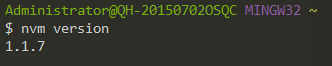
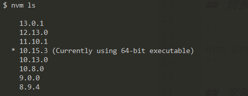
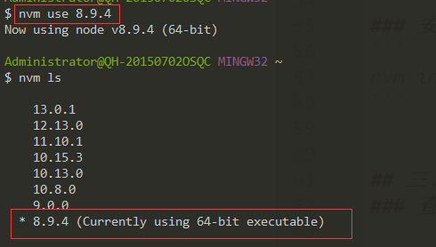
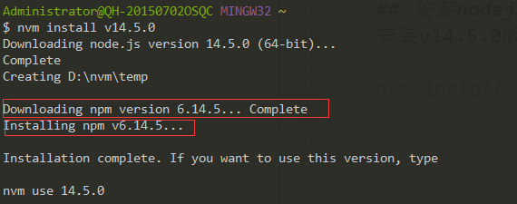

 nvm全名node.js version management，顾名思义是一个nodejs的版本管理工具。通过它可以安装和切换不同版本的nodejs。下面列出下载、安装及使用方法。


# 一、安装

## 1、window下安装

可在点此在[github](https://github.com/coreybutler/nvm-windows/releases)上下载最新版本,本次下载安装的是windows版本。打开网址我们可以看到有两个版本：

nvm-setup.zip：安装版，推荐使用（推荐理由：安装完后不用再设置环境变量）

## 2、mac下安装
```
brew install nvm
```
安装完后按提示修改. ~/.bash_profile
然后执行
```
. ~/.bash_profile
```

## 3、linux安装nvm
```
wget -qO- https://raw.githubusercontent.com/creationix/nvm/v0.33.2/install.sh | bash
```
> 地址可以找最新的地址

下载完后执行

```
source ~/.bash_profile
```

# 二、nvm常用命令

## 查看nvm 版本

```
nvm version
```


## 查看官方node所有版本

```
nvm ls-remote
```
windows版本下不支持

## 查看本地已安装的nodejs版本
```
nvm ls
```

## 切换nodejs版本

```
nvm use v8.9.4
```


## 安装nodejs
安装v14.5.0版本
```
nvm install v14.5.0
```

完整的安装一定是先下载node、然后再安装npm


## 三、其它命令
### 查看npm registry

```
npm get registry
```
### npm淘宝镜像

```
npm config set registry http://registry.npm.taobao.org/
```

### yarn安装
```
npm install yarn -g
```

### 查看yarn registry
```
yarn config get registry
```
### yarn淘宝镜像

```
yarn config set registry http://registry.npm.taobao.org/
```

## nodejs常用版本

```
v8.9.4
v10.15.3
v11.10.1
v12.13.0
```

ps: 
1、用nvm 安装node会自带npm，如果没有npm, 把当前版本删除了再安装

2、在非window环境下、安装node记得在版本前加一个v,不然会发生不可描述的事情

3切换源可以用nrm来切换，[参照文档](nrm.md)
