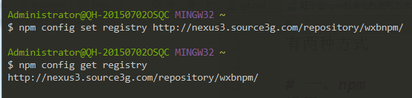

有两种方式

# 一、npm 
设置
```
npm config set registry http://nexus3.source3g.com/repository/wxbnpm/
```
查看 

```
npm config get registry
```



# 二、nrm (建议使用)
添加源

```
nrm add wxbnpm http://nexus3.source3g.com/repository/wxbnpm/
```
使用源
```
nrm use wxbnpm
```


带 * 的是当前源