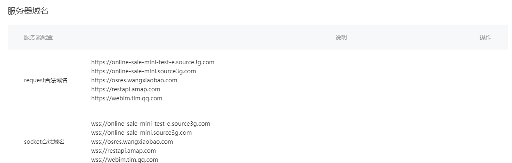
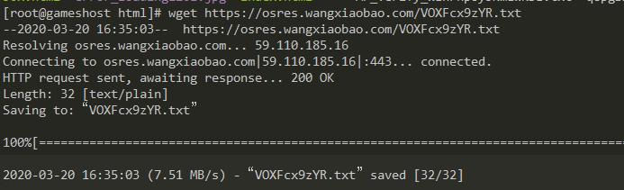
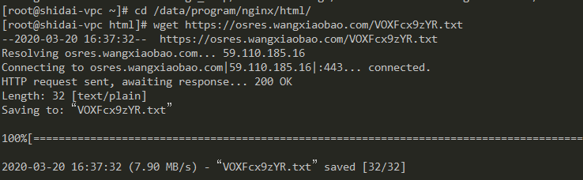
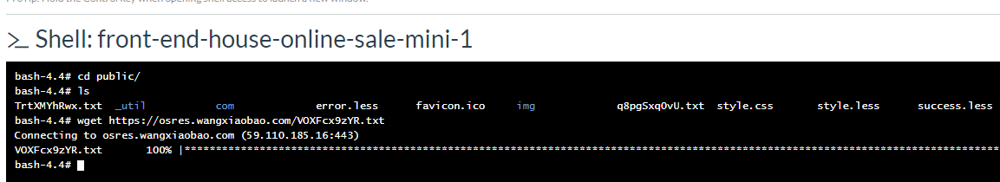
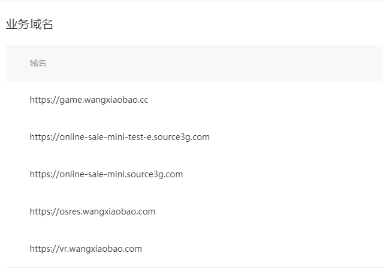

[TOC]

# 微信配置

## 1、登录微信后台
https://mp.weixin.qq.com/

## 2、配置服务器域名

开发-开发设置，request、socket、upload、download、udp合法域名中分别加入下面几个域名

```vuejs
online-sale-mini-test-e.source3g.com
online-sale-mini.source3g.com
osres.wangxiaobao.com
restapi.amap.com
webim.tim.qq.com
wx.qlogo.cn
res2.wx.qq.com
```
配置后如下图：



## 3、配置业务域名

先将业务域名配置里面的txt文件下载下来，上传到osres.wangxiaobao.com下,得到

https://osres.wangxiaobao.com/VOXFcx9zYR.txt

分别将txt放在以下几个域名根目录下
```
osres.wangxiaobao.com
game.wangxiaobao.cc
vr.wangxiaobao.com
online-sale-mini.source3g.com
online-sale-mini-test-e.source3g.com
```

#### game.wangxiaobao.cc 
服务器：10.173.51.116

ssh登录到服务器、将文件下载到nginx静态文件目录下

```
ssh gsopr@10.173.51.116
```
```
sudo su
cd /data/program/nginx_new/html/
wget https://osres.wangxiaobao.com/VOXFcx9zYR.txt
```
如下图：




#### vr.wangxiaobao.com

服务器：172.17.17.64

ssh登录到服务器、将文件下载到nginx静态文件目录下


```
ssh root@172.17.17.64
```

```
cd /data/program/nginx/html/
wget https://osres.wangxiaobao.com/VOXFcx9zYR.txt
```
如下图：




#### online-sale-mini.source3g.com 和 online-sale-mini.source3g.com

在rancher中找到online-sale-mini这个项目，在容器上点执行shell，进入容器

```
cd public
wget https://osres.wangxiaobao.com/VOXFcx9zYR.txt
```
如下图：



验证文件放在我们的服务器后配置域名，完成后：


