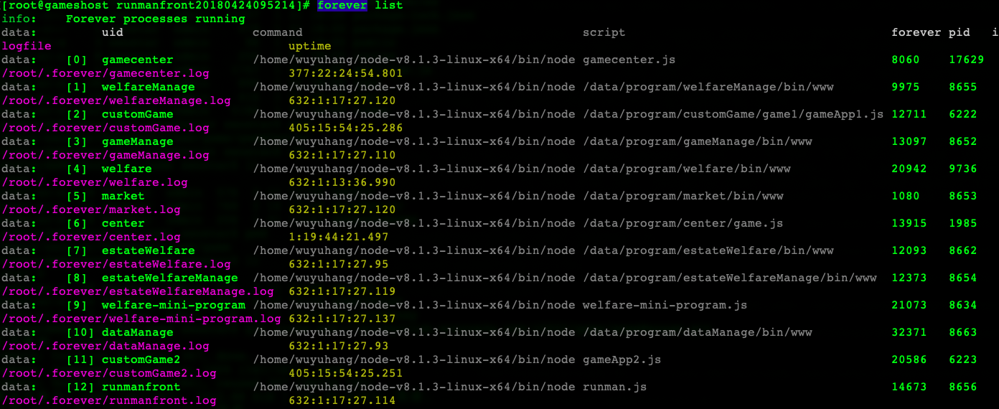

# 服务器
10.173.51.116

gsopr

ssh登录


# 前端nodejs采用的forever部署

## 列出所有服务

```
forever list
```




## 发布游戏代码

```
sudo su
# 进入游戏目录
cd /data/program/center
# 拉取分支代码
git pull 
重启服务
forever restart 10
```

## forever常用命令

```
# 停止服务
forever stop app.js
# 或
forever stop [id]


# 重启服务
forever restart app.js
```


